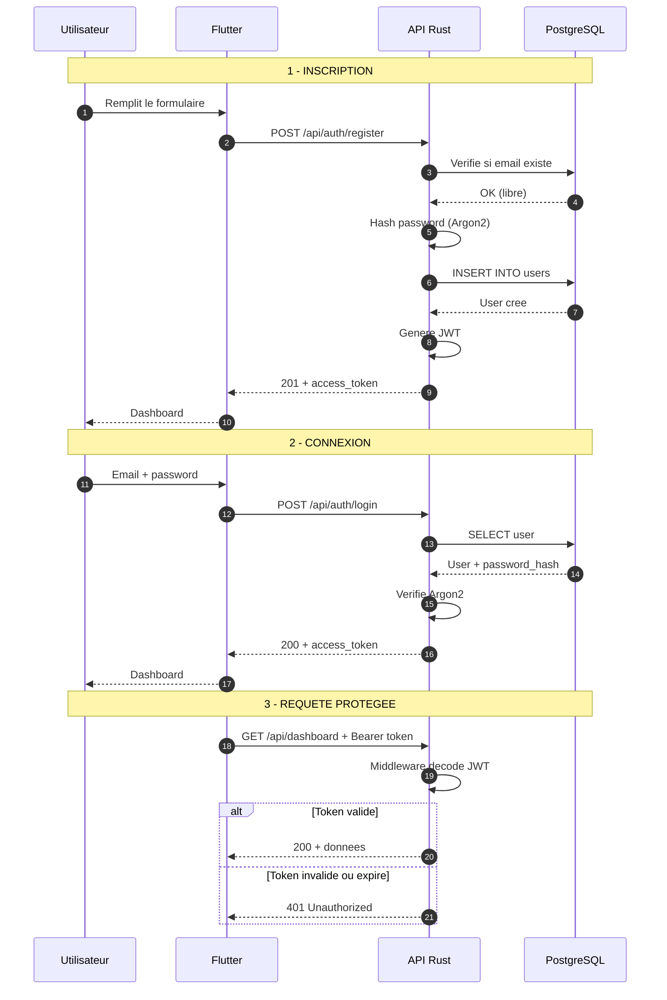
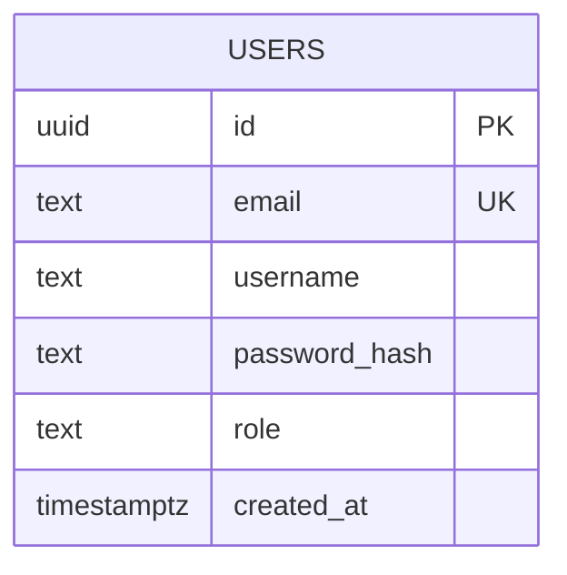
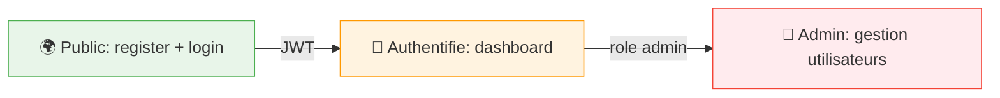

# 🔄 Flux d'authentification et modèle de données

> Documentation visuelle du système d'authentification.

---

## 1️⃣ Flux d'authentification

### 📖 Légende

| Étape | Description |
|-------|-------------|
| **Inscription** | L'utilisateur crée un compte, le mot de passe est haché avec **Argon2** avant stockage. |
| **Connexion** | L'utilisateur envoie email + password, le serveur vérifie le hash et génère un **JWT**. |
| **Requête protégée** | Le client envoie le JWT dans `Authorization: Bearer <token>`. Le middleware vérifie. |

---

## 2️⃣ Modèle de données

### 📋 Détails des colonnes

| Colonne | Type | Description |
|---------|------|-------------|
| `id` | UUID | Clé primaire (sécurité : non énumérable) |
| `email` | TEXT UNIQUE | Email de connexion, indexé |
| `username` | TEXT | Nom d'affichage |
| `password_hash` | TEXT | Hash Argon2id |
| `role` | TEXT | `user` ou `admin` |
| `created_at` | TIMESTAMPTZ | Date de création |

---

## 🛡️ Niveaux d'accès

---

## 📚 Voir aussi

- [README.md](./README.md) — Vue d'ensemble du projet